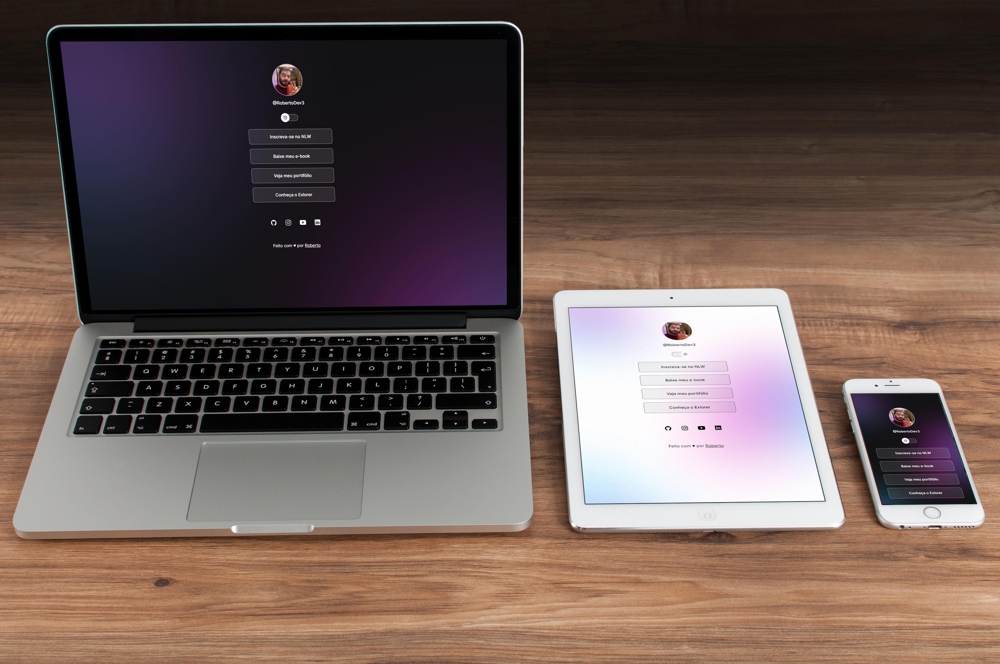

# Links - Dark and Light Mode
O projeto foi realizado com base no curso da [Rocketseat](https://app.rocketseat.com.br), com o intuito de produzir uma pagina de links onde existe a função dark e light mode.

## Layout

## Funcionalidades
- Temas dark e light
- Multiplataforma

## *Tecnologias*
> Html / Css / JavaScript

[⭐ Acesse a pagina clicando aqui ⭐](https://robertodev3.github.io/Links)
